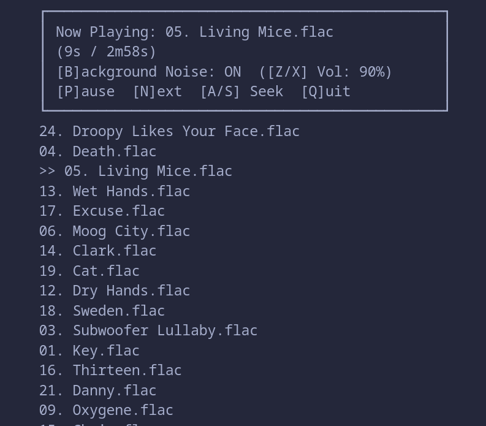

# Zen Player

A minimalistic CLI-based ambient audio player written in Go.
Zen Player allows you to play your music tracks while mixing in background noises such as rain, sea waves, or wind — perfect for focus, studying, or relaxation.


## Features

- Play audio files and playlists from a folder
- Loop and shuffle modes
- Background ambient noises (rain, sea, wind, night, thunder, river)
- Independent control of background noise:
  - Toggle ON/OFF
  - Adjust volume
- Simple terminal UI built with [tcell](https://github.com/gdamore/tcell)
- Audio playback powered by [beep](https://github.com/gopxl/beep)



## Installation
1. **Download executable from [releases](https://github.com/RostislavArts/zen-player/releases)**

2. **Change it's mode**
   ```bash
   chmod +x zen
   ```

3. **Run it**
   ```bash
   ./zen 
   ```

4. **You can also copy it at /usr/bin**
   ```bash
   sudo mv zen /usr/bin
   ```

## Building from source
Make sure you have Go 1.21+ installed.

```bash
git clone https://github.com/RostislavArts/zen-player.git
cd zen-player

make build
```

## Usage

```bash
zen [options] <path>
```

### Arguments

* `<path>` — Path to a file or folder with audio tracks.
  Supported formats: **MP3, WAV, FLAC**.

### Options

* `--noise <list>` — Comma-separated list of background noises.
  Available: `night`, `rain`, `river`, `sea`, `thunder`, `wind`.
  Example: `--noise rain,wind`

* `-l, --loop` — Repeat the playlist or single file in a loop.

* `-s, --shuffle` — Shuffle tracks in the provided folder.

* `--noise list` — Print available background noises and exit.

* `-h, --help` — Show help message and exit.

### Examples

```bash
# Play a folder with shuffled tracks and default "rain" noise
zen --shuffle music/

# Play a single file on repeat
zen --loop sound.mp3

# Play a playlist with sea + wind background noises
zen --noise sea,wind ambient/
```

## Controls

Once the UI is running, you can control playback:

| Key       | Action                                      |
| --------- | ------------------------------------------- |
| **P**     | Play / Pause                                |
| **N**     | Next track                                  |
| **A / S** | Seek backward / forward                     |
| **B**     | Toggle background noise ON/OFF              |
| **Z / X** | Decrease / Increase background noise volume |
| **Q**     | Quit                                        |
